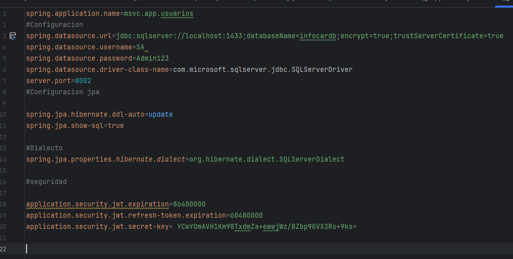
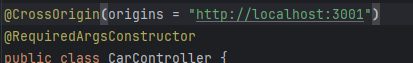

# Proyecto pruebas servicios de gestion de carros 

## **Microservicios infocards**

## **Descripción**
Se pretende por medio de un servicio que se encuentra encapsulado crear una serie de peticiones todas Sobre Rest Full donde se conecta a un servicio de base de datos de SQL server dockerizado  y configurado sobre un archivo docker-compose.yml
el propósito de la encapsulación es para tener un proyecto principal que pueda administrar las dependencias para todos los futuros microservicios


## **Prerequisitos**
- **SpringBoot**
- **Java**
  para este caso se recomienda la versión mínima de java 17 , ya sea con el java de oracle o el open java 
- **Docker**


Se debe clonar el repositorio que se envía con el nombre de car-info.app el cual esta asignado para los cambios y procesos de el backen 

https://github.com/wpradere/car-info.app.git

- Debe ubicarse en la carpeta donde desea el proyecto
- Use el comando git clone

cuando termine el proceso debe abrir el proyecto  con su editor de Código preferido
se recomienda IntelliJ IDEA

- Instale las dependencia ya que el proyecto fue construido bajo Maven
- Puede usar el comando  mvn clean install -U en la terminal
- Paso siguiente debe instalar docker dependiendo de su sistema operativo
- Debe instalar docker compose y ejecutar el comando docker-compose up -U
- Con el comando docker ps puede verificar que el contenedor se encuentre disponible
- instale cualquier gertos de Bases de datos de su preferencia 

- #### script de la base de datos:
```bash
-- Tabla para UserEntity (user_log)
CREATE TABLE user_log (
id BIGINT IDENTITY(1,1) PRIMARY KEY,
username NVARCHAR(255),
password NVARCHAR(255),
email NVARCHAR(255) UNIQUE
);

-- Tabla para Token (tokens)
CREATE TABLE tokens (
id BIGINT IDENTITY(1,1) PRIMARY KEY,
token NVARCHAR(255) UNIQUE,
tokenType NVARCHAR(50) DEFAULT 'BEARER',
revoked BIT,
expired BIT,
user_id BIGINT,
FOREIGN KEY (user_id) REFERENCES user_log(id)
);

-- Tabla para CarEntity (cars)
CREATE TABLE cars_inf (
id BIGINT IDENTITY(1,1) PRIMARY KEY,
marca NVARCHAR(255),
modelo NVARCHAR(255),
year INT,
placa NVARCHAR(255),
color NVARCHAR(255),
car_user_id BIGINT,
FOREIGN KEY (car_user_id) REFERENCES user_log(id)

```
## **Configuracion del proyecto**


## **Configuracion del croosorigin **


se debe hacer deacuerdo a las configuraciones locales proyecto front que se encuentra en next js

adjunto repositorio en github :
https://github.com/wpradere/car-info.app-front.git